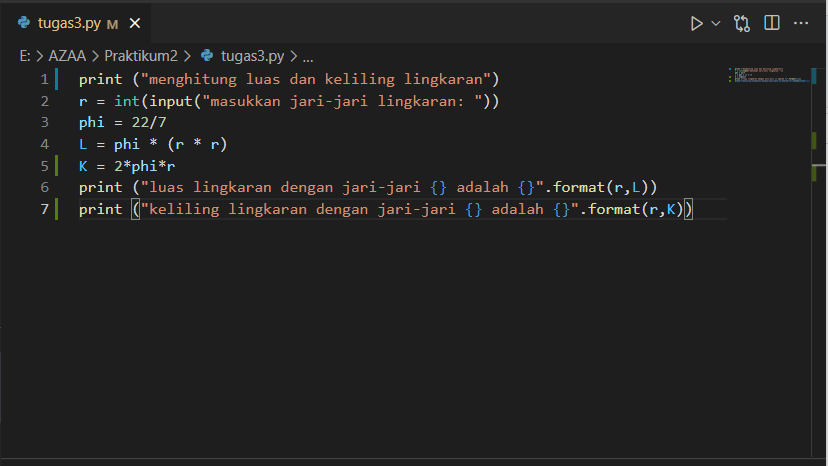
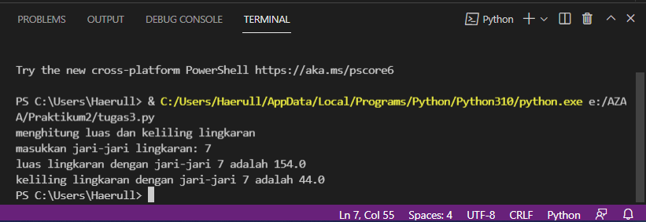
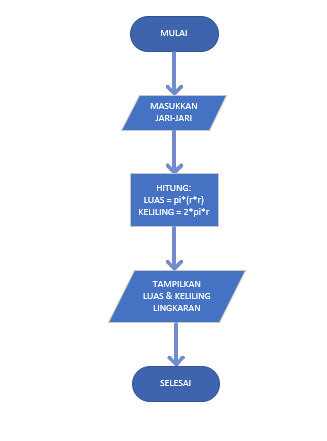
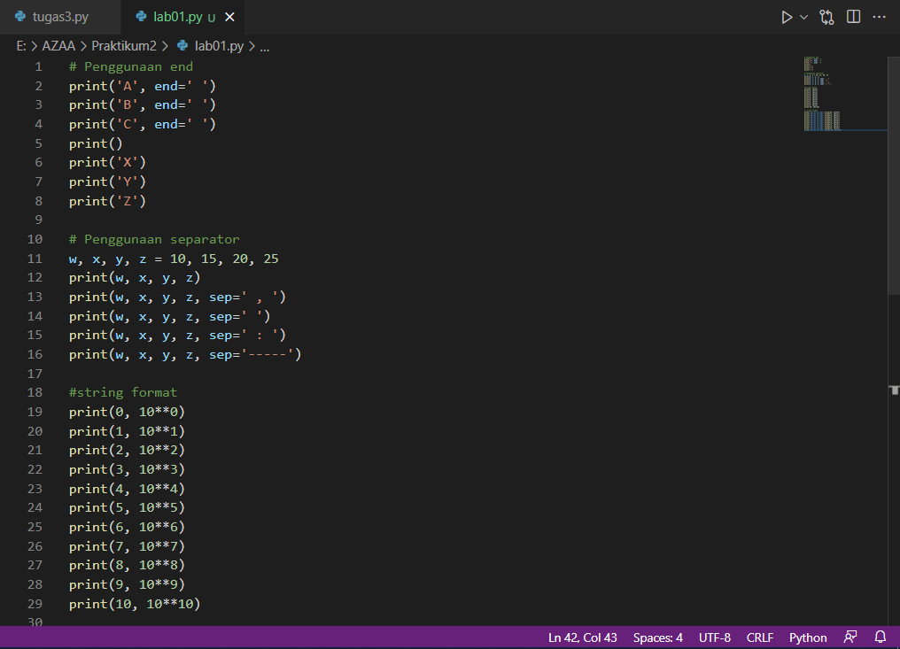
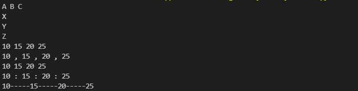

# Praktikum2

# menghitung luas & keliling lingkaran 

1.buatlah script seperti ini

2.masukkan jari-jari lingkaran,jari-jarinya adalah 7,maka akan nimbul hasilnya seperti 
ini :

# Flowchart menghitung luas dan keliling lingkaran

# Penjelasan Lab01
# Penggunaan end

contoh scriptnya

maka outputnya akan muncul

# penggunaan string format

contoh scriptnya

maka outputnya akan muncul

	

# Penjelasan LAB2
# hasil perhitungan

contoh script perhitungan

	

maka outputnya akan muncul

